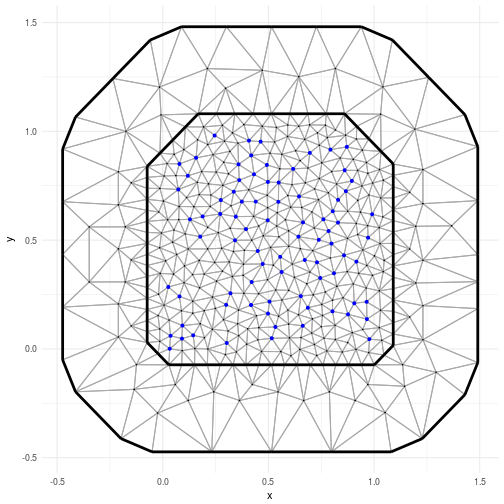

INLAutils
==========

[](https://travis-ci.org/timcdlucas/INLAutils)
[](https://codecov.io/github/timcdlucas/INLAutils?branch=master)


A package containing utility functions for the `R-INLA` package.

There's a fair bit of overlap with [inlabru](www.github.com/fbachl/inlabru).


Installation
-------------

To install, first install `INLA`.


```r
install.packages("INLA", repos="https://www.math.ntnu.no/inla/R/stable")
```

then install `INLAutils`


```r
library(devtools)
install_github('timcdlucas/INLAutils')

library(INLA)
library(INLAutils)
```


Overview
--------


### Plotting


I find the the `plot` function in `INLA` annoying and I like `ggplot2`.
So `INLAutils` provides an `autoplot` method for INLA objects.


```r
      data(Epil)
      ##Define the model
      formula = y ~ Trt + Age + V4 +
               f(Ind, model="iid") + f(rand,model="iid")
      result = inla(formula, family="poisson", data = Epil, control.predictor = list(compute = TRUE))
     
      autoplot(result)
```


There is also an autoplot method for INLA SPDE meshes.


```r
    m = 100
    points = matrix(runif(m * 2), m, 2)
    mesh = inla.mesh.create.helper(
      points = points,
      cutoff = 0.05,
      offset = c(0.1, 0.4),
      max.edge = c(0.05, 0.5))
    
    autoplot(mesh)
```




There are also functions for plotting more diagnostic plots.


```r
 data(Epil)
 observed <- Epil[1:30, 'y']
 Epil <- rbind(Epil, Epil[1:30, ])
 Epil[1:30, 'y'] <- NA
 ## make centered covariates
 formula = y ~ Trt + Age + V4 +
          f(Ind, model="iid") + f(rand,model="iid")
 result = inla(formula, family="poisson", data = Epil,
               control.predictor = list(compute = TRUE, link = 1))
 ggplot_inla_residuals(result, observed, binwidth = 10)
```


```r
 ggplot_inla_residuals2(result, observed, se = FALSE)
```

```
## `geom_smooth()` using method = 'loess'
```


To do list
----------

* `inla.sdm`
* ggplot2 version of `plot.inla.tremesh`
* Make good `plot` and `ggplot` functions for plotting the Gaussian Random Field with value and uncertainty.
* `stepINLA`

