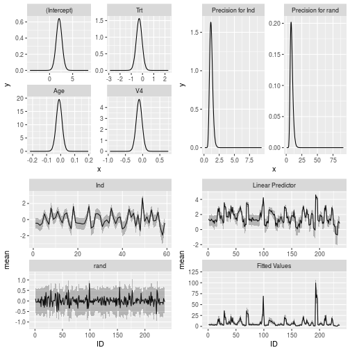

INLAutils
==========

[](https://travis-ci.org/timcdlucas/INLAutils)
[](https://codecov.io/github/timcdlucas/INLAutils?branch=master)


A package containing utility functions for the `R-INLA` package.

There's a fair bit of overlap with [inlabru](http://www.github.com/fbachl/inlabru).


Installation
-------------

To install, first install `INLA`.


```r
install.packages("INLA", repos="https://www.math.ntnu.no/inla/R/stable")
```

then install `INLAutils`


```r
library(devtools)
install_github('timcdlucas/INLAutils')

library(INLA)
library(INLAutils)
```


Overview
--------


### Plotting


I find the the `plot` function in `INLA` annoying and I like `ggplot2`.
So `INLAutils` provides an `autoplot` method for INLA objects.


```r
      data(Epil)
      ##Define the model
      formula = y ~ Trt + Age + V4 +
               f(Ind, model="iid") + f(rand,model="iid")
      result = inla(formula, family="poisson", data = Epil, control.predictor = list(compute = TRUE))
     
      autoplot(result)
```




There is an autoplot method for INLA SPDE meshes.


```r
    m = 100
    points = matrix(runif(m * 2), m, 2)
    mesh = inla.mesh.create.helper(
      points = points,
      cutoff = 0.05,
      offset = c(0.1, 0.4),
      max.edge = c(0.05, 0.5))
    
    autoplot(mesh)
```


There are functions for plotting more diagnostic plots.


```r
 data(Epil)
 observed <- Epil[1:30, 'y']
 Epil <- rbind(Epil, Epil[1:30, ])
 Epil[1:30, 'y'] <- NA
 ## make centered covariates
 formula = y ~ Trt + Age + V4 +
          f(Ind, model="iid") + f(rand,model="iid")
 result = inla(formula, family="poisson", data = Epil,
               control.predictor = list(compute = TRUE, link = 1))
 ggplot_inla_residuals(result, observed, binwidth = 0.1)
```


```r
 ggplot_inla_residuals2(result, observed, se = FALSE)
```

```
## `geom_smooth()` using method = 'loess'
```


Finally there is a function for combining shapefiles, rasters (or INLA projections) and meshes.
For more fine grained control the geoms defined in [inlabru](http://www.github.com/fbachl/inlabru) might be useful.


```r
# Create inla projector
n <- 20
loc <- matrix(runif(n*2), n, 2)
mesh <- inla.mesh.create(loc, refine=list(max.edge=0.05))
projector <- inla.mesh.projector(mesh)

field <- cos(mesh$loc[,1]*2*pi*3)*sin(mesh$loc[,2]*2*pi*7)
projection <- inla.mesh.project(projector, field)

# And a shape file
crds <- loc[chull(loc), ]
SPls <- SpatialPolygons(list(Polygons(list(Polygon(crds)), ID = 'a')))

# plot
ggplot_projection_shapefile(projection, projector, SPls, mesh)
```


### Analysis

There are some helper functions for general analyses.


`INLAstep` runs stepwise variable selection with INLA.


```r
  data(Epil)
  stack <- inla.stack(data = list(y = Epil$y),
                      A = list(1),
                      effects = list(data.frame(Intercept = 1, Epil[3:5])))
                      
  result <- INLAstep(fam1 = "poisson", 
                     Epil,
                     in_stack = stack,
                     invariant = "0 + Intercept",
                     direction = 'backwards',
                     include = 3:5,
                     y = 'y',
                     y2 = 'y',
                     powerl = 1,
                     inter = 1,
                     thresh = 2)
  
  result$best_formula
```

```
## y ~ 0 + Intercept + Base + Age + V4
## <environment: 0x1094d8e0>
```

```r
  autoplot(result$best_model, which = 1)
```


`makeGAM` helps create a function object for fitting GAMs with INLA.


```r
 data(Epil)
 formula <- makeGAM('Age', invariant = '', linear = c('Age', 'Trt', 'V4'), returnstring = FALSE)
 formula
```

```
## y ~ +Age + Trt + V4 + f(inla.group(Age), model = "rw2")
## <environment: 0x134fc610>
```

```r
 result = inla(formula, family="poisson", data = Epil)
```


### Domain specific applications


To do list
----------

* `inla.sdm`
* ggplot2 version of `plot.inla.tremesh`
* Make good `plot` and `ggplot` functions for plotting the Gaussian Random Field with value and uncertainty.
* `stepINLA`

